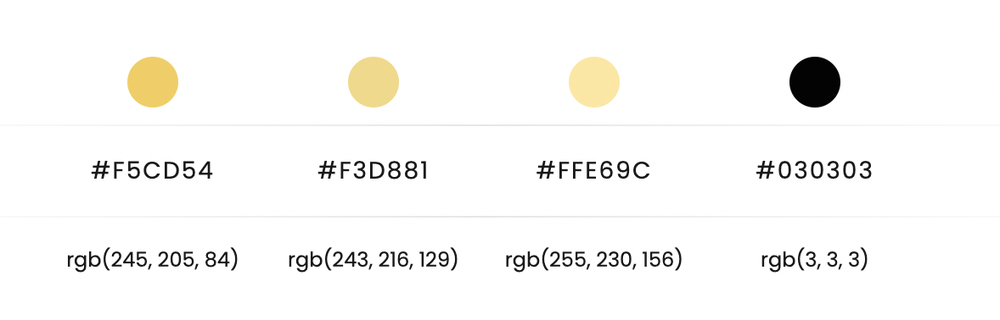

# Tic-tac-toe-GAME

TIC-TAC-TOE
<h1 align="center"> TIC-TAC-TOE GAME</h1> 

<h6 align="center">Game for two players who take turns marking the spaces in a three-by-three grid with X or O. </h3>

This is the third project created in the GeekHub Academy Bootcamp. A way to evaluate the knowledge acquired during the third and fourth week of bootcamp. 

 

<strong>Genre:</strong> 
Pen and paper game

<strong>Players:</strong> 
2

<strong>Strategy:</strong> 
High

<strong>Skills:</strong> 
Strategy, tactics, observation

<strong>Ages:</strong> 
All

<strong>Complexity:</strong> 
Little

#### Parts:
1. Home: LANDING PAGE
2. PLAYER SELECTION
 
3. GAME PAGE
 
4. VICTORY PAGE
 
5. DEFEAT PAGE  
6. DRAWN PAGE

<h2 align="center">Herramientas y recursos</h2>

### Tecnologias:
- HTML
- Css: Grid
- Bootstrap5
- Javascrip

### Colores utilizados: 

### Documentacion utilizada:

##### 1.
- https://www.w3schools.com/jsref/jsref_random.asp 
##### 2.
- https://stackoverflow.com/ 

---
### Referencias y codigo en el que me apoye

- https://en.wikipedia.org/wiki/Tic-tac-toe 
- https://playtictactoe.org/
- https://codepen.io/lando464/pen/BPGEKO
- https://manualestutor.com/javascript/crea-un-juego-tic-tac-toe-usando-javascript/

[^1]

[^1]: Por LizaCastDiaz
